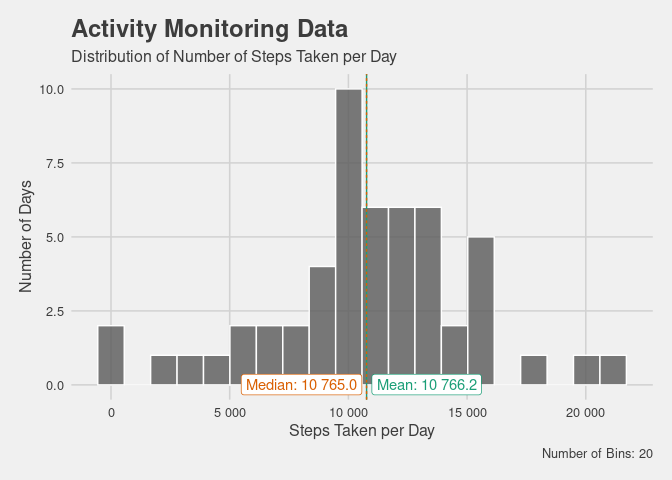
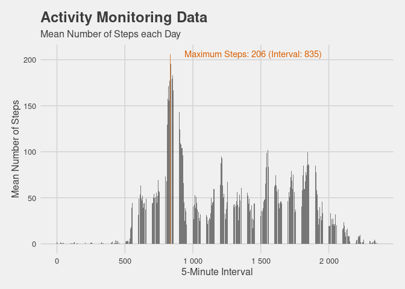
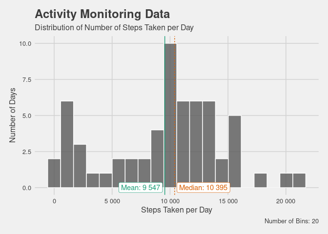
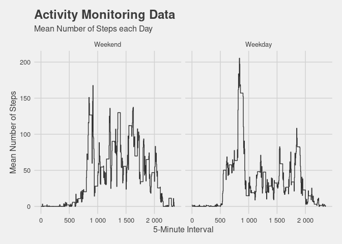

## Loading and preprocessing the data

```r
options(tidyverse.quiet = T)

library(ggplot2)
library(ggthemes)
library(scales)
library(tidyverse)
library(ggrepel)

theme_set(
  theme_fivethirtyeight() +
    theme(legend.position = "bottom",
          axis.title = element_text())
)

f <- unz("activity.zip", "activity.csv")
df <- as_tibble(readr::read_csv(f))
```

```
## Parsed with column specification:
## cols(
##   steps = col_double(),
##   date = col_date(format = ""),
##   interval = col_double()
## )
```

```r
df$Weekday <- lubridate::wday(df$date, label=T, abbr=F)
df$Weekend <- factor(df$Weekday %in% c("Saturday", "Sunday"),
                     c(T,F),
                     c("Weekend", "Weekday"))

glimpse(df)
```

```
## Rows: 17,568
## Columns: 5
## $ steps    <dbl> NA, NA, NA, NA, NA, NA, NA, NA, NA, NA, NA, NA, NA, NA, NA, …
## $ date     <date> 2012-10-01, 2012-10-01, 2012-10-01, 2012-10-01, 2012-10-01,…
## $ interval <dbl> 0, 5, 10, 15, 20, 25, 30, 35, 40, 45, 50, 55, 100, 105, 110,…
## $ Weekday  <ord> Monday, Monday, Monday, Monday, Monday, Monday, Monday, Mond…
## $ Weekend  <fct> Weekday, Weekday, Weekday, Weekday, Weekday, Weekday, Weekda…
```


## What is mean total number of steps taken per day?

```r
df.perDay <- df %>% 
              filter(!is.na(steps)) %>% 
              group_by(date) %>% 
              summarize(steps = sum(steps, na.rm=T))

df.Summary <- tribble(~Type, ~steps,
                      "Mean", mean(df.perDay$steps, na.rm = T),
                      "Median", median(df.perDay$steps, na.rm = T))

df.perDay %>% 
  ggplot(aes(x=steps)) +
    geom_histogram(bins=20, color="white",alpha=.8) +
    
    geom_vline(data = df.Summary, aes(xintercept = steps, color=Type, linetype=Type)) +
    geom_label_repel(data = df.Summary, 
                    aes(x = steps, color=Type, label = paste0(Type, ": " , scales::number(steps))),
                    y = 0,direction="x") +
      
    labs(title = "Activity Monitoring Data",
         subtitle = "Distribution of Number of Steps Taken per Day",
         caption = "Number of Bins: 20") +
    ylab("Number of Days") +
    scale_x_continuous(labels = scales::number, 
                       name = "Steps Taken per Day") +
    scale_color_brewer(type="div", palette="Dark2") +
    
   
    theme(legend.position = "none")
```

<!-- -->


## What is the average daily activity pattern?

```r
df.MeanInterval <- df %>% 
                    filter(!is.na(steps)) %>% 
                    group_by(interval) %>%
                    summarize(steps = mean(steps)) %>% 
                    mutate(Color = max(steps) == steps)

Maximum <- df.MeanInterval %>% 
            filter(Color == T)

df.MeanInterval %>% 
  ggplot(aes(x=interval, y=steps, fill=Color)) +
    geom_bar(stat="identity",alpha=.8) +
    geom_text(data=Maximum, aes(label=paste0("Maximum Steps: ", round(steps), " (Interval: ", interval, ")"), color=Color), 
              hjust=-.1) +
      
    labs(title = "Activity Monitoring Data",
         subtitle = "Mean Number of Steps each Day") +
    ylab("Mean Number of Steps") +
    scale_x_continuous(labels = scales::number, 
                       name = "5-Minute Interval") +
    scale_fill_manual(values=c("grey35","#D95F02")) +
    scale_color_manual(values=c("#D95F02")) +
    theme(legend.position = "none") 
```

<!-- -->


## Imputing missing values

### Number of Missing Rows


```r
knitr::kable(df %>% 
 filter(is.na(steps)) %>% 
 nrow() %>% 
 tibble(`Missing Rows` = .))
```


| Missing Rows|
|------------:|
|         2304|

### Imputation

```r
df.Imputed <- df %>% 
                filter(!is.na(steps)) %>% 
                group_by(interval, Weekend) %>% 
                summarize(steps.imputed = median(steps))

df.Imputed <- df %>%
                left_join(df.Imputed, 
                          by=c("interval", "Weekend")) %>% 
                mutate(steps = coalesce(steps, steps.imputed)) %>% 
                select(-steps.imputed)

knitr::kable(df.Imputed %>% 
 filter(is.na(steps)) %>% 
 nrow() %>% 
 tibble(`Missing Rows` = .))
```


| Missing Rows|
|------------:|
|            0|

### Plot new Distribution

```r
df.perDay <- df.Imputed %>% 
              filter(!is.na(steps)) %>% 
              group_by(date) %>% 
              summarize(steps = sum(steps, na.rm=T))

df.Summary <- tribble(~Type, ~steps,
                      "Mean", mean(df.perDay$steps, na.rm = T),
                      "Median", median(df.perDay$steps, na.rm = T))

df.perDay %>% 
  ggplot(aes(x=steps)) +
    geom_histogram(bins=20, color="white",alpha=.8) +
    
    geom_vline(data = df.Summary, aes(xintercept = steps, color=Type, linetype=Type)) +
    geom_label_repel(data = df.Summary, 
                    aes(x = steps, color=Type, label = paste0(Type, ": " , scales::number(steps))),
                    y = 0,direction="x") +
      
    labs(title = "Activity Monitoring Data",
         subtitle = "Distribution of Number of Steps Taken per Day",
         caption = "Number of Bins: 20") +
    ylab("Number of Days") +
    scale_x_continuous(labels = scales::number, 
                       name = "Steps Taken per Day") +
    scale_color_brewer(type="div", palette="Dark2") +
    
   
    theme(legend.position = "none")
```

<!-- -->

The median has not changed that much from the base value without any imputed values. The mean has shifted towards lower estimates.

## Are there differences in activity patterns between weekdays and weekends?

```r
df.Weekday <- df.Imputed %>% 
                group_by(interval, Weekend) %>% 
                summarize(steps = mean(steps)) 

df.Weekday %>% 
  ggplot(aes(x=interval, y=steps)) +
    geom_step(alpha=.8) +
  
    labs(title = "Activity Monitoring Data",
         subtitle = "Mean Number of Steps each Day") +
    ylab("Mean Number of Steps") +
    scale_x_continuous(labels = scales::number, 
                       name = "5-Minute Interval") +
    scale_fill_manual(values=c("grey35","#D95F02")) +
    scale_color_manual(values=c("#D95F02")) +
    theme(legend.position = "none") +
    facet_wrap(.~Weekend)
```

<!-- -->

The distribution of steps on weekends and weekdays is different. Though on both Weekends and Weekdays we see a peak of steps at around the interval 800, the mean number of steps on weekdays decreases dramtically after this peak throughout the intervals until another peak occurs around the interval 1 800. Whereas on weekends we see a nearly normal distributed mean number of steps with more steps taken in each interval compared to weekdays.
